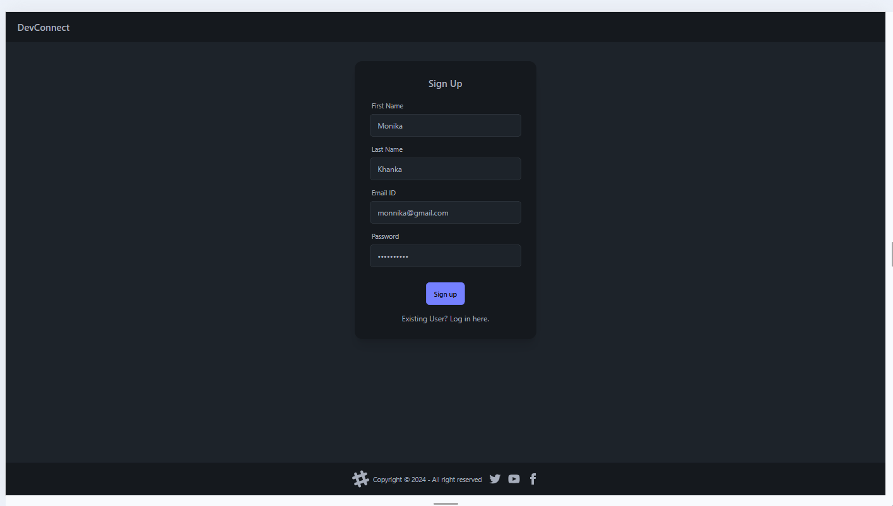
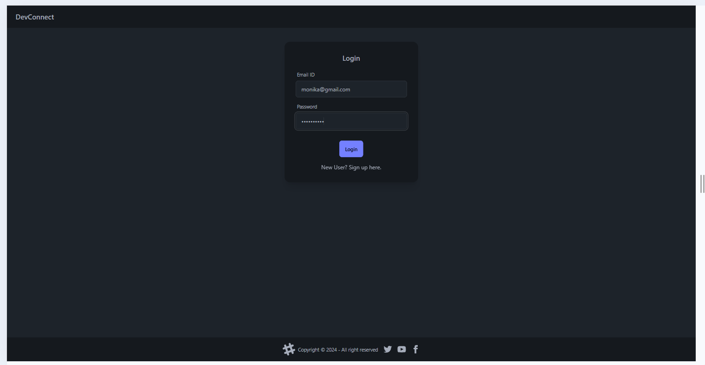
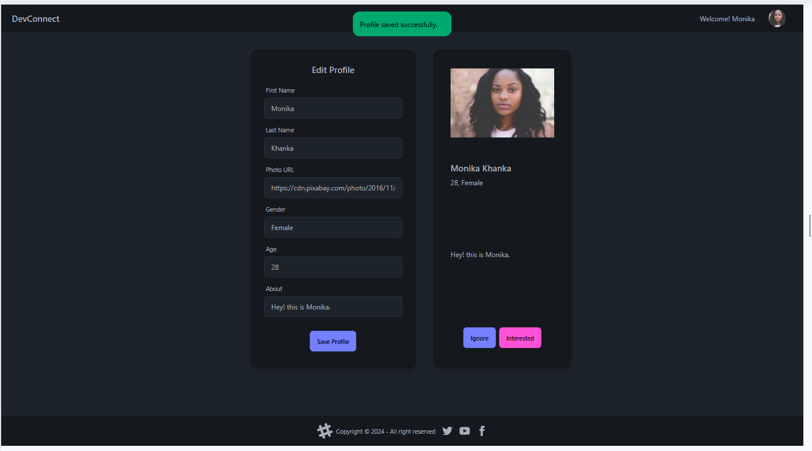
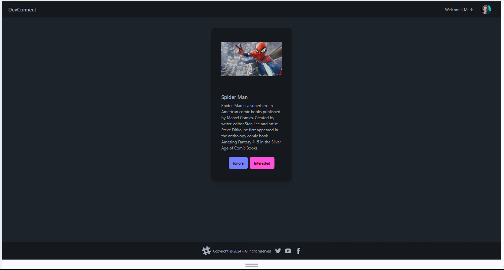
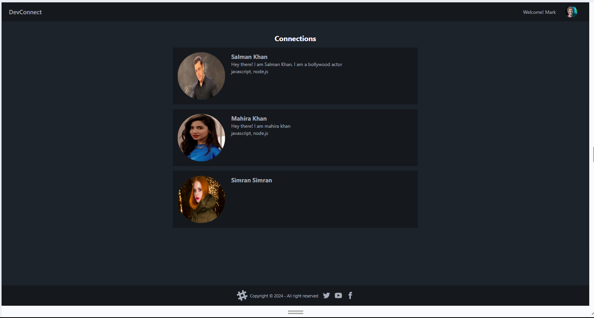
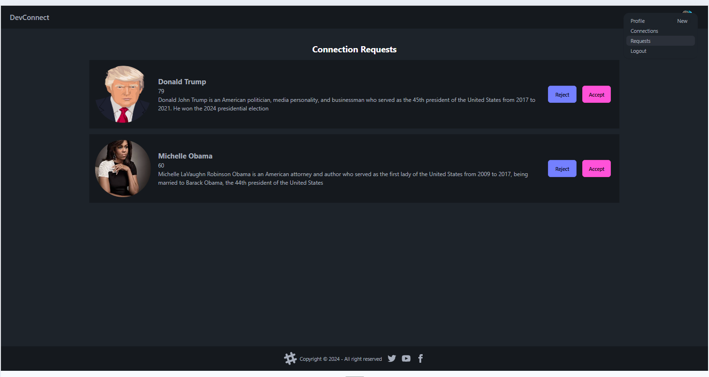

# DEVConnect

DEVConnect is a web app designed to help developers connect based on their skills, interests, and goals. It lets developers show interest or ignore the profiles of developers to find collaborators for projects, mentors, or even co-founders.

## Features:

- Sign up Page - for signing up or registering a new user
- Log in Page - for logging in the user.
- Profile Page - To update the profile by entering photoUrl, skills, age etc.
- Feed Page - Ignore/Accept profiles and match with other developers, to send connection requests.
- Connections - To display the profiles of all connections.
- Requests - To display the profiles of all requests received.
- Logout Page - To log out user.

## Screenshots

- Sign up Page
  

- Login Page
  

- Profile Page
  

- Feed Page
  

- Connections Page
  
  
- Requests Page
  

## Installation:

Steps to set up the project locally:

Frontend:

1. Clone the repository
   git clone https://github.com/monikakhanka/devconnect-web.git
2. Navigate to the project directory
   cd devconnecct-web
3. Install dependencies
   npm install
4. Start the development server
   npm start dev

Backend:

1. Clone the repository
   git clone https://github.com/monikakhanka/devconnect.git
2. Navigate to the project directory
   cd devconnect
3. Install dependencies
   npm install
4. create .env file in the root directory of your project and add the following environment variables:
   replace the <enclosed> fields with your credentials
   PORT=3000
   DATABASE_URL="mongodb+srv://<username>:<password>@cluster0.rshmv.mongodb.net/<database_name>"
   ORIGIN_URL="http://localhost:5173"
   JWT_SECRET="<JWT_SECRET>

## Technologies used:

List of tools, libraries and frameworks used in the project

- Frontend: React, daisyui
- Backend: Node.js
- Database: Mongodb cluster
- Build tool: Vite
- Deployment: Render

## How it works

Steps to use the app:

1. Sign up:

- Create a profile by entering First Name, Last Name, Email Id and Password.
- On successful sign up, profile page opens, where user can update the profile informations.

2. Log in:

- If the user already exist, then login using Email Id and Password.
- On successful log user is directed to feed page.

3. Feed:

- Through the feed page, user can send connection request to other developers.
- User can show interest or ignore the profiles of fellow developers.
- On submiting any of the two options Ignore/Interested, profile of next developer in the list, who is not a connection yet shows up.

4. Connections:

- A list of all the connections with few details

5. Requests:

- List of all the connection requests from other developers to the logged in user
- Logged In user can accept or reject the requests
- Once accepted, the accepted requests are listed in connection page

6. Logout:

- For logging out the user

## Roadmap

- Chat feature to communicate with fellow developers
